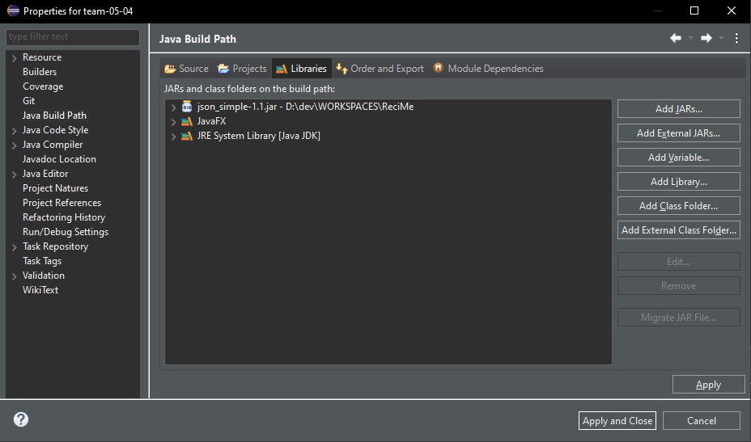
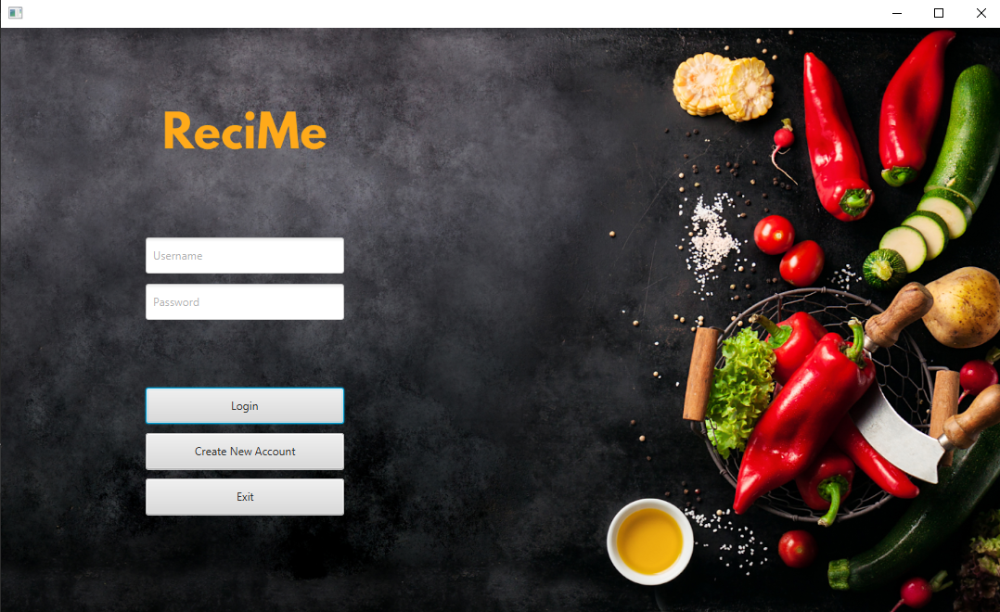
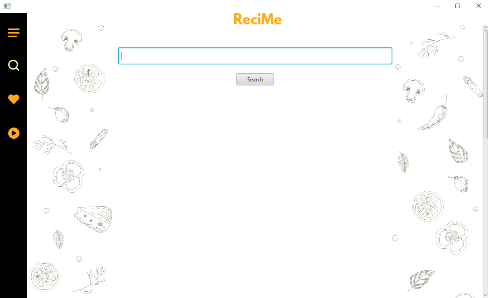
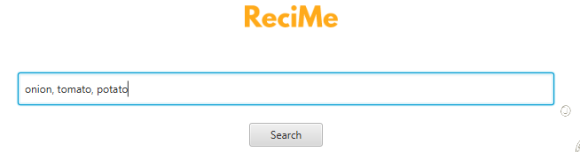
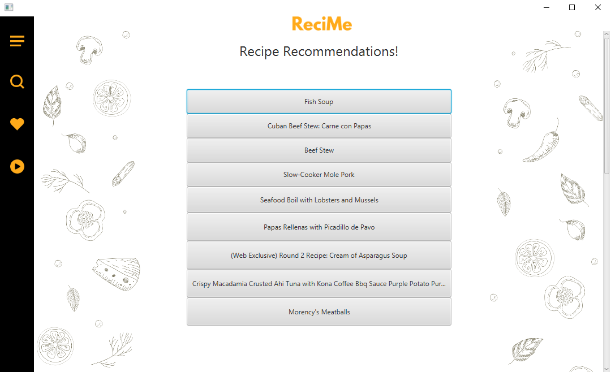
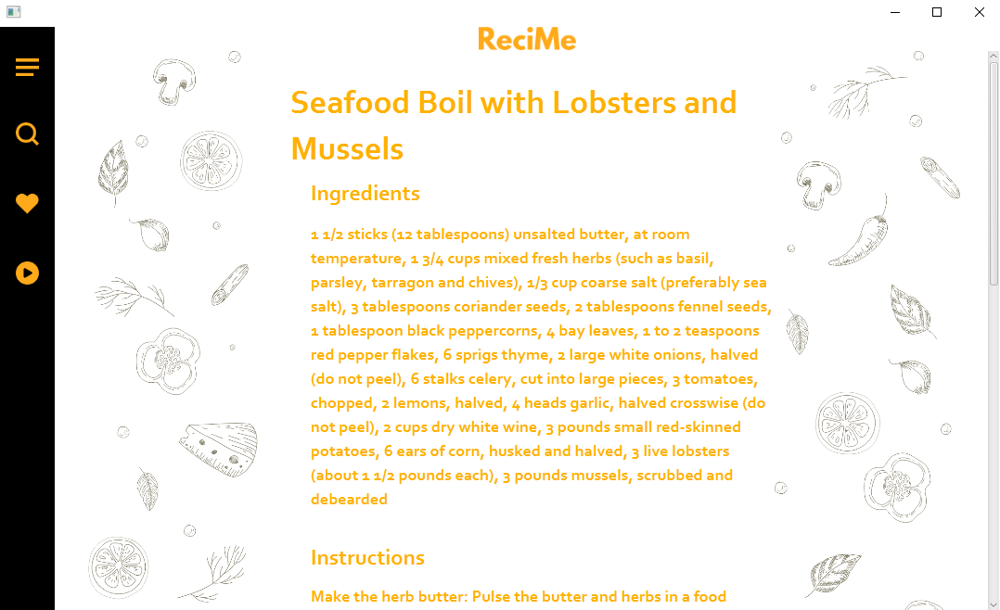
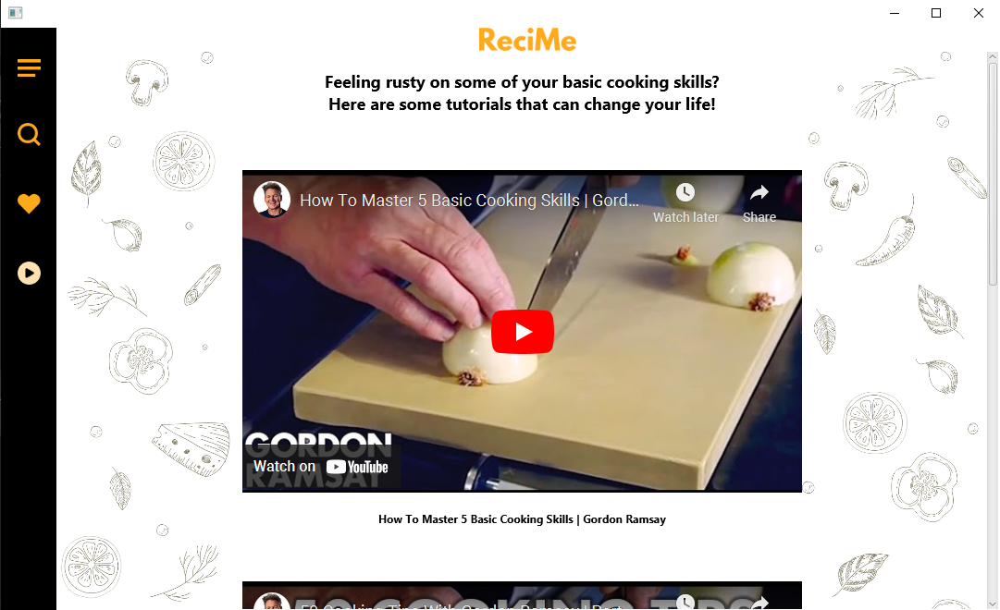

# ReciMe
A Recipe Recommendation app to suggest recipes based on the ingredients you want to use. <br>
This was built in a team of 4 in 2021 using Java, JavaFX, and EclipseIDE.

# Features
- Search for recipes based on ingredients list
- Open a recipe for full ingredient list and cooking instructions
- Watch tutorial videos on basic cooking skills
- Supports multiple user accounts with password authentication

# Installation Guide
1. Install [Eclipse IDE for Java Developers](https://eclipseide.org/)
2. Install [json_simple-1.1.jar](https://code.google.com/archive/p/json-simple/downloads)
3. Download the code via Git Clone or .zip
4. Install [JavaFX SDK](https://gluonhq.com/products/javafx/)
5. Install JavaFX Plugin for Eclipse IDE from Eclipse Marketplace
6. Import project into Eclipse IDE
7. Configure Eclipse IDE to run JavaFX Applications <br>
    - Eclipse IDE > Project > Properties > Java Build Path > Libraries > Add Library > User Libraries <br>
    <figure>
         <br>
        <figcaption>End result should look like this with all the necessary libraries</figcaption>
    </figure>
8. Setup VM Arguments in Run Configurations <br>
    ```
    --module-path D:\dev\javafx-sdk-21.0.2\lib --add-modules javafx.controls,javafx.fxml,javafx.web
    ```

# Screenshots
<figure>
    <figcaption style="font-size: 16px;">Login Page</figcaption>
    
</figure>
<br>

<figure>
    <figcaption style="font-size: 16px;">Home Page</figcaption>
    
</figure>
<br>

<figure>
    <figcaption style="font-size: 16px;">Recommendations Page</figcaption>
    <div style="display: flex; flex-direction: column;">
        
        <br>
        
    </div>
</figure>
<br>

<figure>
    <figcaption style="font-size: 16px;">Recipe Page</figcaption>
    
</figure>
<br>

<figure>
    <figcaption style="font-size: 16px;">Tutorial Page</figcaption>
    
</figure>
<br>
